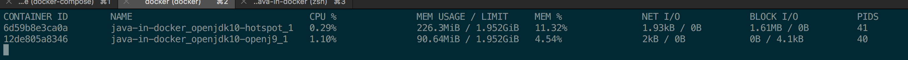

# Java in Docker

This repo contains example of running a simple SpringBoot app in a Docker container.

Examples are based on the Docker images produced by the amazing [AdoptOpenJDK](https://adoptopenjdk.net/) project.

## Build

The [docker-compose.yml](docker-compose.yml) file contains configuration to build all containers.

To create the images:

```
> docker-compose build
```

## Run

To run the built images:


```
> docker-compose up
```

## Compare

Some basic initial comparisons can be performed using:

```
> docker stats
```

This shows output similar to:



An initial observation is that the OpenJ9 container had a base memory footprint of 90iMB whereas Hotspot is 226MiB.

## TODO

- Introduce more containers
- Perform comparisons under different types of load

